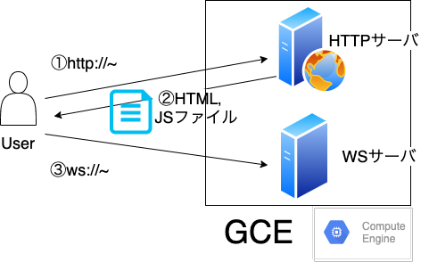

# **WS Chat**
## 第1回（2020/06/25）

---

### 発端
- WebSocket使ってみたい→チャットアプリ作れそう
  - なおチャットアプリが一般的にどういう技術で作られているかは知らない
  - 世の中に溢れているので車輪の再発明にはなる

---

### 目的
- チーム開発の経験を積みたい
- アジャイル開発の練習（？）
- 技術習得

---

### 現状
- GCE上にHTTPサーバ，WSサーバ両方を構築
- 今後は違うサービスを使う可能性あり
  - Firebase Hosting
  - AWS
  - Heroku

@snap[south-east span-45]

@snapend

---

### 開発言語・環境
- GitHubでソースコード管理
- クライアント側
  - JavaScriptのフレームワークを使ってみる
  -  とりあえずVue.js
- サーバ側
  - Python

---

### 開発の流れ（1回目のみ）
1. GitHubのcollaboratorになる
2. クローン→ブランチを切る
3. 編集
4. プッシュ→プルリク
5. 管理者がマージ

---

```bash
git clone https://github.com/yousukeayada/WSChat.git
git branch feature/test
git checkout feature/test
（編集）
git add .
git commit -m “message”
git push origin feature/test
```

---

### 開発の流れ（2回目以降）
1. masterブランチに戻る
2. プル→ブランチを切る
3. 編集
4. プッシュ→プルリク
5. 管理者がマージ

---

```bash
git checkout master
git pull origin master
git checkout -b feature/ayada
（編集）
git add .
git commit -m “message”
git push origin feature/ayada
```

---

### 今後欲しい機能（暫定）
- 認証（OAuth）
- いいね
- 履歴保存（DB）
- チャンネル